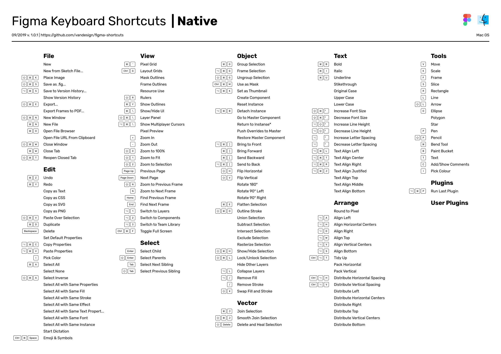

### [ENG](./README.md)

# Список горячих клавиш для Figma
Клавиатурные сокращения для Windows и Mac OS скомпонованы на страницах формата А4.

## PDF
Вы можете скачать файлы в формате PDF.
- [figma-shortcuts-windows-native.pdf](./pdf/figma-shortcuts-windows-native.pdf)
- [figma-shortcuts-macos-native.pdf](./pdf/figma-shortcuts-macos-native.pdf)

## Figma
По ссылке исходный файл в Figma. Вы можете сделать дубликат.
🖖 Figma Link: [Figma Keyboard Shortcuts](https://www.figma.com/file/PUnOKWnIsQxBFrFAGVBgEW/Figma-Keyboard-Shortcuts?node-id=0%3A1)

## Помощь
Пожалуйста, создайте
[новый ишью](https://github.com/vandesign/figma-shortcuts/issues/new)
, если вы нашли ошибку или у вас есть вопросы.
