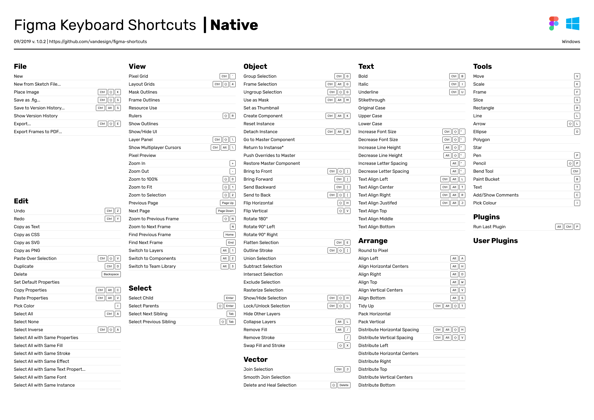
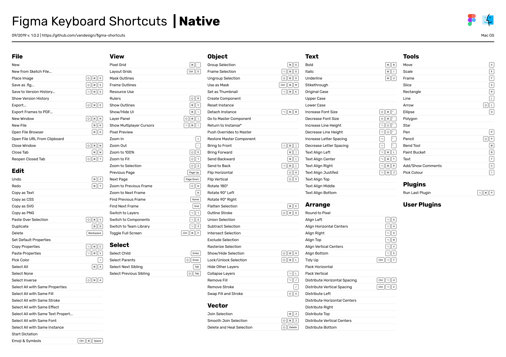

### [РУС](./README-RU.md)

# Shortcuts for Figma
Hotkeys for Windows and Mac OS.

## PDF
You can download PDF.
- [figma-shortcuts-windows-native.pdf](./pdf/figma-shortcuts-windows-native.pdf)
- [figma-shortcuts-macos-native.pdf](./pdf/figma-shortcuts-macos-native.pdf)

## Figma
You can open shared Figma file and duplicate it.
🖖 Figma Link: [Figma Keyboard Shortcuts](https://www.figma.com/file/PUnOKWnIsQxBFrFAGVBgEW/Figma-Keyboard-Shortcuts?node-id=0%3A1)

## Error
Please send me all bugs.
